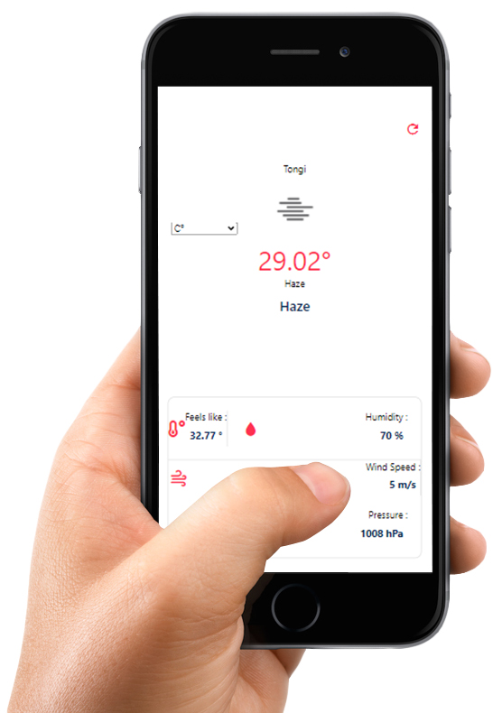

# Weather React App
Weather React Native App provides weather updated using OPENWEATHERMAP Api.

# Live Demo

# Features

• React Native Weather app provide accurate Weather update using Api.
• When user open this app then have to provide allow location access.
• Getting the city location this app show city name and weather update.

# Tools: 

• expo

• expo-location

• expo-statusbar 
